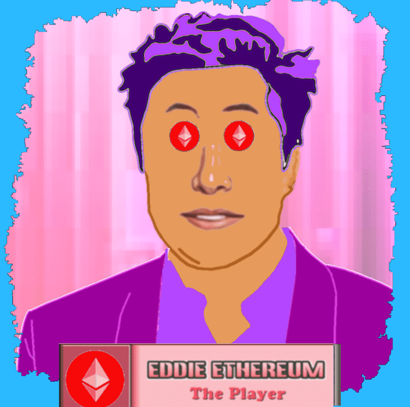

# Crypto Boyz Night Out

由 TK 迈尔斯创建

这个 NFT COLLECTION 是一套色彩丰富的 10,000 个独特的 NFT 数字收藏品。每个 NFT 都是基于“前 8 名”市值密码的 8 个不同字符中的一个。Bobby Bitcoin-Eddie Ethereum-Benny Binance-Charlie Cardano-Tommy Tether-Xavier XRP-Sal Solana & Pete Polkadot你的 NFT 将有 7 个属性，每个属性特征的范围从常见到超级稀有。有趣的因素在 NFT 的属性部分，您将看到每个属性的稀有度值，以及一个数值。这个数字称为该属性的 FUN FACTOR。（乐趣因子 0 = 最常见）（乐趣因子 100 = 最稀有）。这些总和将决定 NFT 的稀有度以及未来哪些“奖励”NFT 将空投到您的钱包中。您的原始 NFT 越稀有，您的“奖励”NFT 就越稀有。Boyz 正在镇上度过一个冒险和兴奋的夜晚。你的加密男孩会玩得开心吗？你的 NFT 会讲述这个故事……

