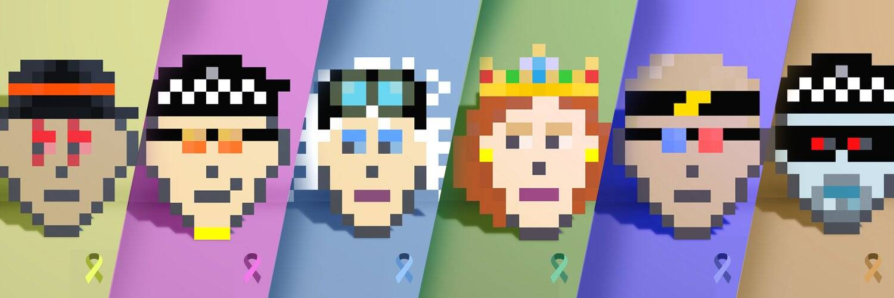

# CryptoBozosNFT

~~888 创世纪薄荷 售罄~~ 由儿童设计的 7777 个像素 NFT 头像的集合，这些头像建立在以太坊区块链上，具有不同的特征和稀有度。一个有远见的、实用驱动的 NFT 项目，旨在通过将癌症意识带入 METAVERSE,CryptoBozos
建立在以太坊区块链上的 7777 个像素 NFT 头像集合，具有不同的特征和稀有度。 一个有远见的、实用驱动的 NFT 项目，旨在通过将癌症意识带入 METAVERSE 来影响生活,CryptoBozos NFT 支持癌症意识！

隐藏在我们的第二次掉落中的是 7 个金色 Bozos。
每一个都有一个传奇的稀有丝带 1/7777。
你能把它们都收集起来吗？

