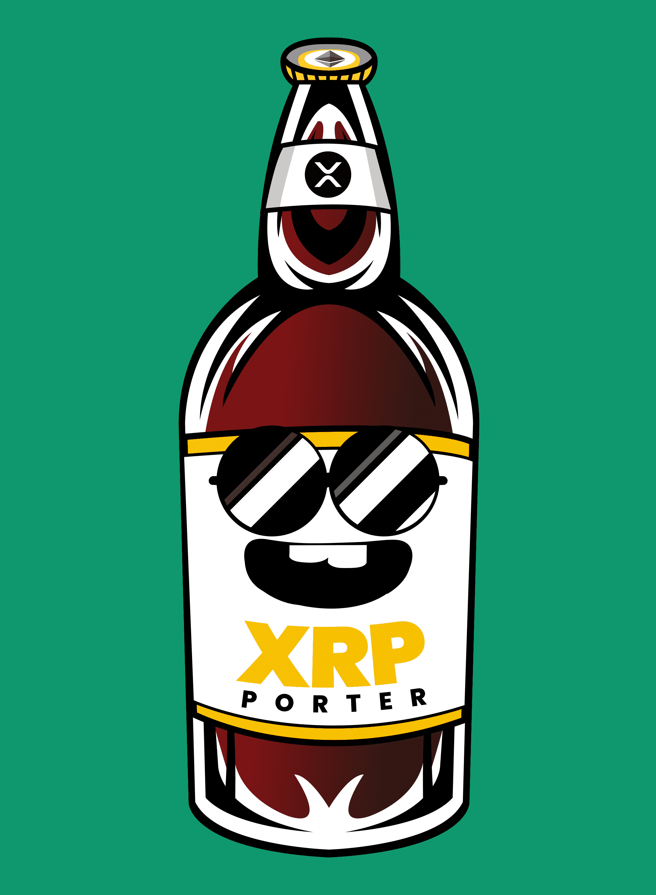

# Crypto Brewery NFTs

加密啤酒厂。555 种加密啤酒将永远在区块链上保持新鲜！啤酒厂总共只酿造了 555 种加密啤酒，这些啤酒将永远在区块链上保持新鲜！独一无二——每一种啤酒都是独一无二的，没有一种是独一无二的。每种啤酒都是随机生成的，具有自己的特点和风味特征啤酒厂– 每个加密啤酒 NFT 都是一个访问令牌，并为啤酒厂提供会员资格，等待您的独家福利。这包括收入分成、现实世界的啤酒商品等等ERC-721 – 所有加密啤酒 NFT 代币都以自己的智能合约存储在以太坊区块链上，并且所有铸造的代币都将在 opensea.io 上可用啤酒酿造——你没听错！我们将在您可以享受的“现实世界”中酿造新鲜啤酒。如果您拥有 NFT，您可以独家访问啤酒厂自己的新鲜啤酒！ 

