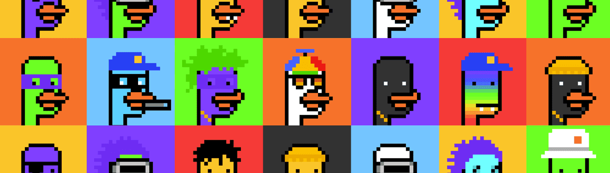

# CryptoBurbs

你有没有想象过艺术但不必从树上剪纸？现在您可以使用区块链技术在信息高速公路上交易艺术品！

我们为我们的网络艺术选择了一个完美的主题，土鸟！它们的大小从大到小不等，可以在不使用火箭或反重力技术的情况下飞行。

当人类看艺术时，它可以提高他们的催产素水平。它涉及大脑的愉悦和奖励中心。这就是为什么所有人都会喜欢 CryptoBurbs II ©®™，这是来自访客 #1116（网站管理员）和访客 #6291（艺术家） 的全新创意。

