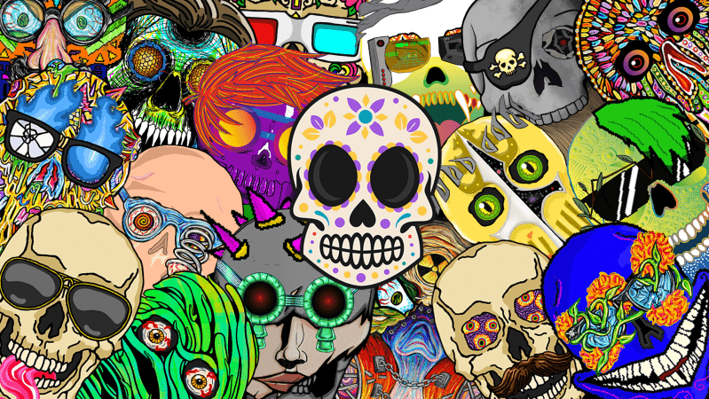

# Crypto Calaveras NFT

Crypto Calaveras 是一个生成艺术项目，展示了 8 位不同墨西哥艺术家的作品：Crimson Rider、Thundersteel、Billie Alter、EMSAR、JAMEX、Stutter、Payos 和 RΞY。

这个项目的主题是传统的“墨西哥亡灵节”头骨。然而，每位艺术家都通过自己的个人风格和愿景重新诠释主题。 

我们的团队分割了每位艺术家的卡拉维拉，并生成了 1,584 个完全独特的版本。这使头骨混合了各种风格和表达方式，使观众惊讶于单件的多样性。 

Calavera Crew 的一个关键组成部分是提高对来自墨西哥地区的艺术的认识，并将焦点放在所涉及的艺术家身上。制作发自内心的 NFT、艺术品和体验也是我们的目标 <3 ！

Crypto Cavalera 会员资格：

