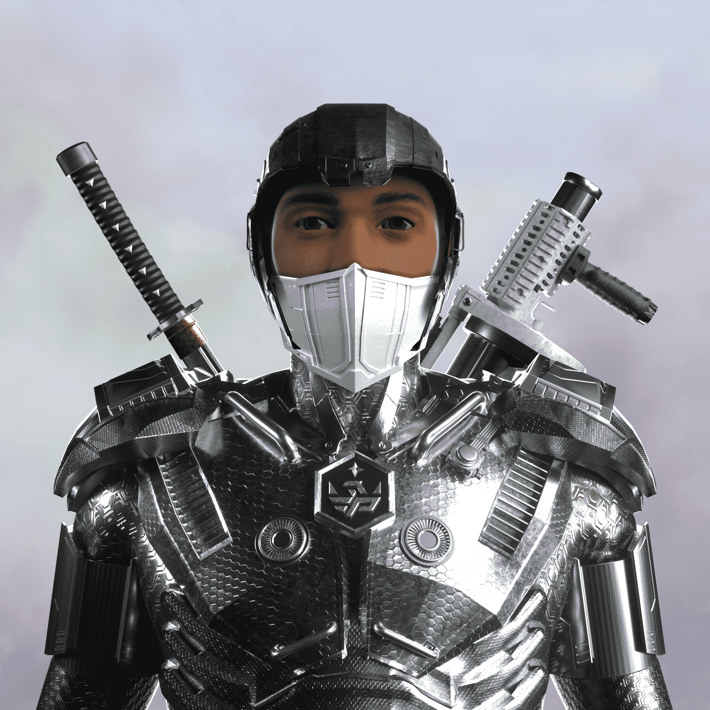

# Crypto Champions NFT Official Collection

Crypto Champions 是 8,888 个独特的 NFT 角色的集合，分为生活在以太坊区块链上的两个派系。持有一名加密货币冠军将授予您使用社区基金、VX AirDrop、私人策划者等的权利。被动赚取$AMMO，质押您的 NFT连接钱包Crypto Champions 是 8,888 个独特 NFT 的集合，可以访问独家 Web3 社区（NFT、加密货币、元界和加密游戏）。此外，Champion 的持有者将拥有独家信息、社交活动、在线策划者和嘉宾的私人访问权限。Crypto Champions 是优质 3D 人体模型的第一个集合。特权和叛军这两个派系拥有独特的风格、表情、制服、武器和其他 136 种不同的特征。动物的 2D 图片很酷，但 Metawar 需要逼真的 3D 人类士兵。Crypto Champions 是 8,888 个独特的 NFT 角色的集合，分为生活在以太坊区块链上的两个派系。每个冠军都是准备在即将到来的元战争中战斗的原始属性组合。这是第一个以卓越和超逼真的 3D 人类士兵艺术品为特色的系列，并为持有者提供了首创的实用工具。

