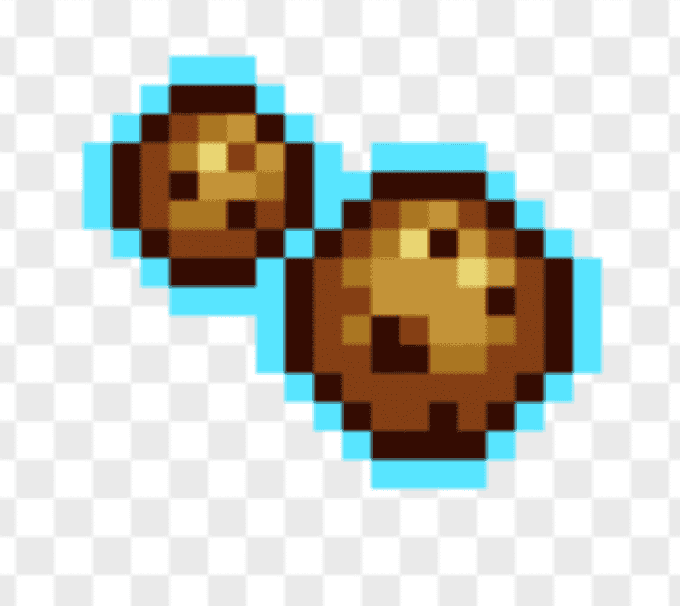

# CryptoCookies Achievements

第一款 NFT 闲置游戏CryptoCookies 是一款经济背景复杂的 NFT 趣味休闲游戏。
在对 NFT 游戏空间有些失望之后，一群开发者决定创建一个公平有趣的游戏，这就是 CryptoCookies 的诞生方式。公平竞争没有奇怪的代币经济学或鲸鱼优势。您可以只用几个 MATIC 开始玩 CryptoCookies。该协议将根据 $CKIE 与 $MATIC 的当前价格销毁 $CKIE 或使用它们来创造更多流动性。增加购买压力该协议将向市场增加一些卖出压力，同时将 $CKIE 转换为 $MATIC 以建立流动性来应对这一点，我们创建了一个债券机制。SugarBank 将在 MATIC 中以固定价格出售 $CKIE，并将使用此价格重新购买 $CKIE 并创造更多流动性。用户可以在 5 天的归属期内赎回债券。债券价格每天都会下降一小部分，直到达到债券接受者接受的价格。

