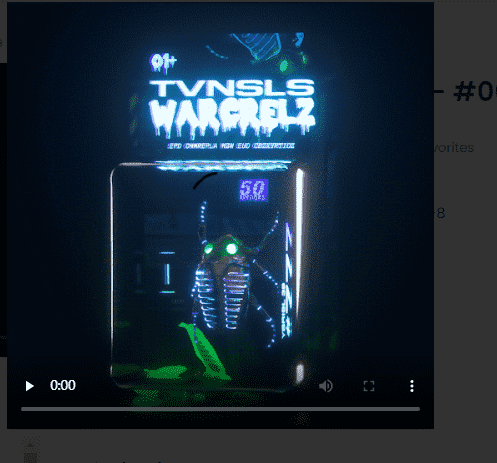

# CryptoCrawlerz

规格
ERC-1155
CryptoCrawlerz NFT 是以太坊区块链上的 ERC-1155 多版代币，图像托管在 IPFS 上。

效用
CryptoCrawlerz NFT 提供了广泛的实用性。每个 NFT 都可以作为您进入The Hive的通行证，这是一个仅对 CryptoCrawlerz 持有者开放的会员制俱乐部。

智能合约
我们的 NFT 是根据我们自己的智能合约铸造的。新的 drop 部署在Rarible和OpenSea上。我们也在LooksRare上进行交易。

奖励
拥有 CryptoCrawlerz NFT 使您有资格获得 $BUGZ ERC-20 奖励。阅读下面有关 $BUGZ 代币和当前奖励系统的更多信息。

