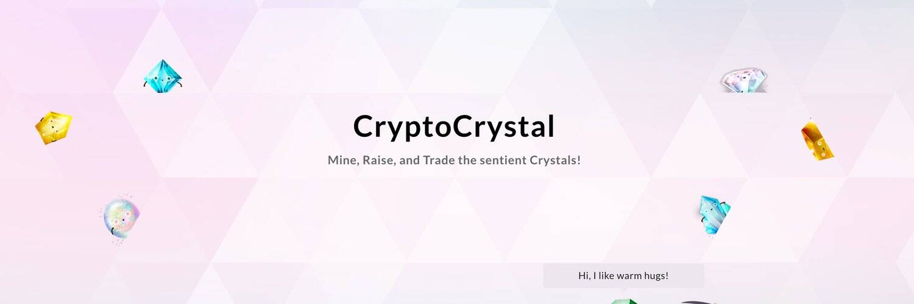

# CryptoCrystal

CryptoCrystal 是有知觉的闪亮水晶，具有与人类相似的个性，同时又像宠物一样过于可爱。它们中的每一个在以太坊中都是独一无二的，没有重复的 DNA 结构。

CryptoCrystal 不是 CryptoCurrency，而是 CryptoCollectible。CryptoCrystal 除了智能合约外，没有管理运营商。智能合约中的每个定义都将公开。任何人，甚至开发人员，都不能更改稀有率或合同的其他方面。

CryptoCrystal 是作为 Quan Inc. 的子项目创建的，是一家位于东京的字符/贴纸公司，全球下载量超过 45 亿。最终，该项目交给了产品负责人 Kohei Nakamura，他是以太坊的日本影响者，也是日本最大的以太坊钱包 tokenPocket 的创始人。Kohei Nakamura 还是 Double Jump Tokyo 和 MyCryptoheroes 的顾问。

