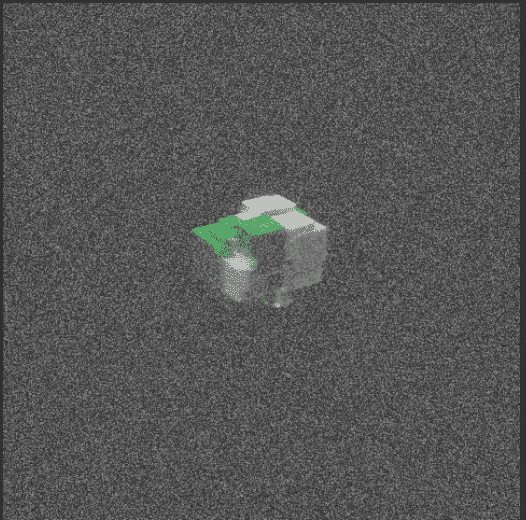

# CryptoCubes

CryptoCubes 统计数据
创建于近 2 年前
254代币供应
OpenSea 验证集合
10% 费用
5,506 位推特关注者
过去 7 天没有出售 CryptoCube。

256 个虚拟地标..
▶ 什么是 CryptoCubes？
CryptoCubes 是一个 NFT（不可替代令牌）集合。存储在区块链上的数字艺术品集合。
▶ 有多少 CryptoCubes 代币？
总共有 254 个 CryptoCubes NFT。目前 148 位所有者的钱包中至少有一个 CryptoCubes NTF。
▶ 最昂贵的 CryptoCubes 销售是什么？
最昂贵的 CryptoCubes NFT 是 CryptoCube#80。它于 2022 年 8 月 23 日（10 天前）以 7.7 万美元的价格售出。
▶ 最近卖出了多少 CryptoCubes？
过去 30 天内售出了 1 个 CryptoCubes NFT。

