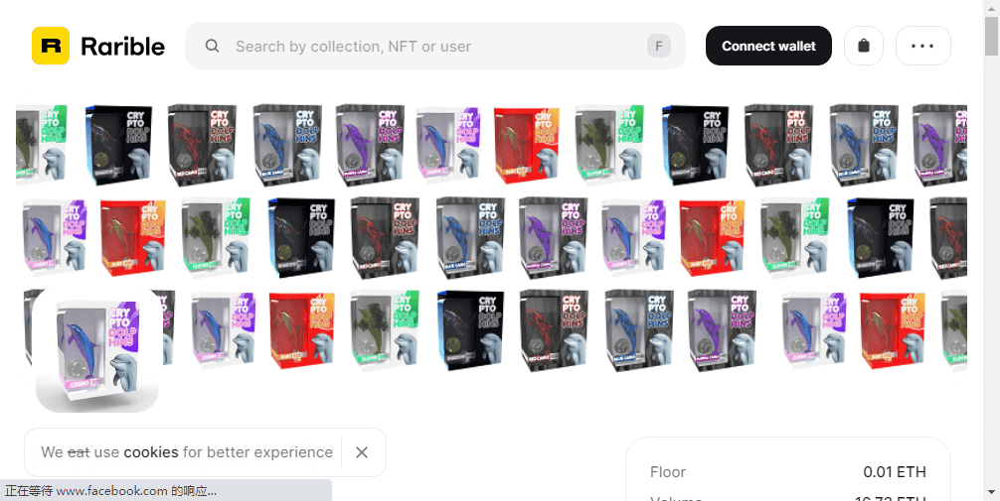

# Crypto Dolphins

加密海豚统计
创建于 1 年多前
46 代币供应
0.1% 费用
过去 7 天内没有出售任何加密海豚。

收集 35 个𝗟𝗶𝗺𝗶𝘁𝗲𝗱𝗘𝗱𝗶𝘁𝗶𝗼𝗻𝗡𝗙𝗧𝗖𝗼𝗹𝗹𝗲𝗰𝘁𝗶𝗯𝗹𝗲𝘀

于 2021 年 2 月 14 日在以太坊区块链上创建。

#海豚小队
Crypto Dolphins NFT - 常见问题（FAQ）
▶ 什么是加密海豚？
Crypto Dolphins 是一个 NFT（非同质代币）集合。存储在区块链上的数字艺术品集合。
▶ 有多少 Crypto Dolphins 代币？
总共有 46 个 Crypto Dolphins NFT。目前，259 位所有者的钱包中至少有一个 Crypto Dolphins NTF。
▶ 最近卖出了多少只加密海豚？
过去 30 天内售出 0 个 Crypto Dolphins NFT。

