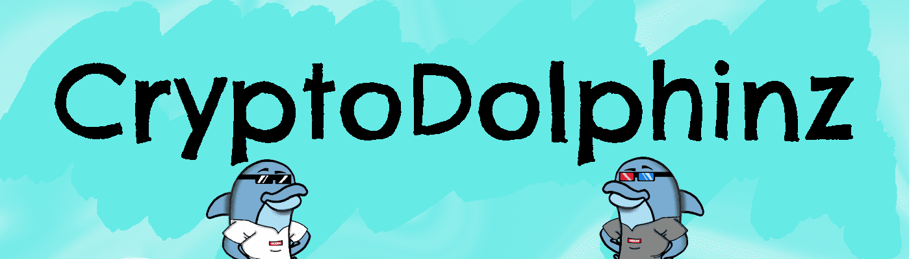

# CryptoDolphinz

CryptoDolphinz 是 Polygon 网络上的一个 NFT 项目，其背后有着特殊的使命。我们希望帮助拯救我们的海洋，同时拥有一个有趣的独家收藏品来向您的朋友和家人炫耀。CryptoDolphinz 最终将在未来发展成为元界/游戏。

将铸造 7,777 只海豚。所有特征都是手绘的，有超过 120 个特征（包括眼睛、衬衫、配饰、背景等），产生了超过 1 亿种不同的组合。所有 Dolphinz 都是独一无二的，每个 Dolphinz 的造币厂价格对造币厂 + 汽油费都是免费的。

