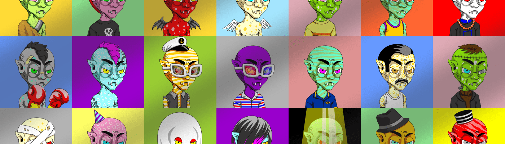

# CryptoDracula

CryptoDracula 是一个受虚构人物“德古拉”启发的 NFT 集合。每个 CryptoDracula 都以不同的风格和角色生成，例如肤色、配饰、表情、衣服等。一些 CryptoDracula 角色还模仿真实角色和虚构角色的风格（角色扮演）。每个 CryptoDracula 只会发布 1 个版本，因此每个 Dracula 100% 都是独一无二的。具有一套新功能、协议机制和增强的用户体验。我们现在有一个原生于以太坊的工作基础产品和一个可演示的应用程序，这将有助于扩展我们的连接和未来的产品供应。尽管我们对 ETH 2.0 DeFi 的未来非常乐观，但我们很清楚目前越来越高的 gas 费用的进入壁垒，以及这些费用如何使普通流动性提供者难以加入——我们的最终意图用户。我们的目标一直是简化 DeFi 体验，

