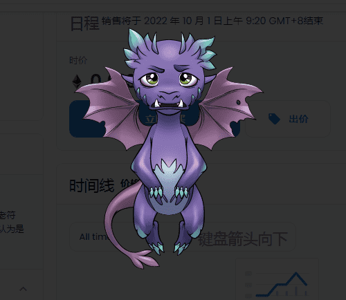

# CryptoDragons.CD

艺术与科技
具有数百个基因变异和各种颜色层的复杂 DNA。

龙币
CryptoDragons 项目的硬币，将在我们的元界中使用。

配种
为你的龙选择一对，繁殖它并获得你独特的后代。

NFT 战斗
在竞技场上战斗，赢得以太坊或 NFT 龙。

CryptoDragons 的原生代币是符合 ERC20 标准的 CryptoDragons Coin，或 CDC，最大供应量为 1 亿枚。除了传奇龙、突变龙和某些密切相关的龙之外，所有龙最多可以繁殖 5 次（上限是为了防止每条龙产生过多的后代）。

养龙需要在CDC付款，价格以龙以前的养殖数量为准。累积的繁殖费用将定期在平台和传奇龙所有者之间分配。已达到发展门槛的龙可以通过参加战斗竞技场和卡牌游戏在元界中获得收益。龙的拥有者也可以通过销售和出租赚取收入。传奇龙的独特之处在于它们通过繁殖获得收益的能力。

