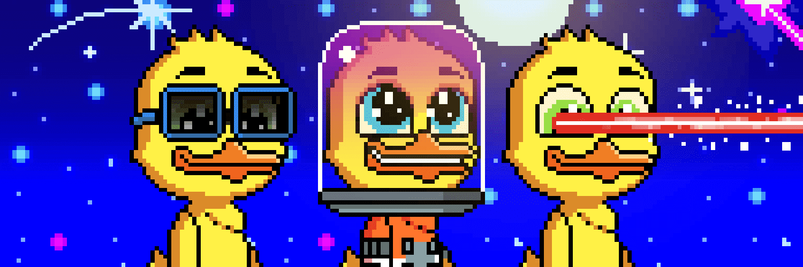

# CryptoDucks Genesis

虽然我们在 NFT 和 Crypto 领域为自己做得很好，但我们的团队个人被抓获并包揽了更多的无实用程序 pfp 项目和 rugpulls，我们无法计算。有种撕心裂肺的感觉。

#### 我们相信我们是这个领域的先驱。像我们这样做的项目并不多。只是为了给您一个想法，如路线图所示，我们将大部分收益返还给持有者（您），将我们的铸币厂重新投资于自我维持的 De-Fi 协议并开发我们的 Play 2 Earn 游戏（这正是机构投资者在扫地时寻找的东西。）

诚实的事实是，90% 以上的 NFT 项目都是懒惰的现金攫取……因此为什么你会看到所有这些地毯式拉扯和失败的项目。

现在很多创始人只是“快速推出”一个可怜的系列......没有什么可展示的，没有路线图，没有关于薄荷钱的计划，只有几千张数字图像，任何三年级学生都可以在课间休息时在他们的 iPad 上制作.

这是可悲和恶心的。我们正在树立榜样，提高标准。

让他们向我们学习。CryptoDucks 是前往火星的单程票。

