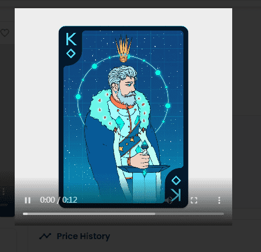

# Playing Arts Crypto Edition

加密状态 NFT
一副扑克牌，上面有 55 位主要艺术家的作品。
生活在以太坊区块链上的独特数字艺术收藏品。将卡片悬停在下方以查看动画。
点击阅读艺术品背后的故事并了解艺术家。来自 67 个国家的 537 位艺术家参加了设计大赛，展示了他们对定制扑克牌的愿景。每位参赛者都被要求以他们独特的风格为一张特定的卡片创作一件艺术品。299 位国际艺术家、设计师和工作室正在使用扑克牌作为画布，展示他们对 100 年后世界的愿景。选定的艺术品形成了两个未来版甲板。

