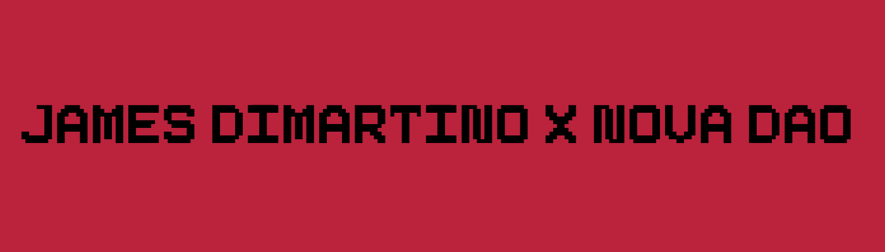

# CryptoFarm Book

James DiMartino 的 CryptoFarm 是对 Web3 空间和以太坊力量的奥威尔式评论。该项目仅限于 1000 个 ERC721A 代币，并与 Nova DAO 合作推出。▶ 什么是 CryptoFarm 书？
CryptoFarm Book 是一个 NFT（不可替代令牌）集合。存储在区块链上的数字艺术品集合。
▶ 有多少 CryptoFarm Book 代币？
总共有 1,000 个 CryptoFarm Book NFT。目前，671 位所有者的钱包中至少有一本 CryptoFarm Book NTF。
▶ 最昂贵的 CryptoFarm 图书销售是什么？
出售的最昂贵的 CryptoFarm Book NFT 是 CryptoFarm。它于 2022 年 6 月 22 日（2 个月前）以 0.5 美元的价格出售。
▶ 最近卖出了多少 CryptoFarm Book？
过去 30 天内售出了 2 个 CryptoFarm Book NFT。

