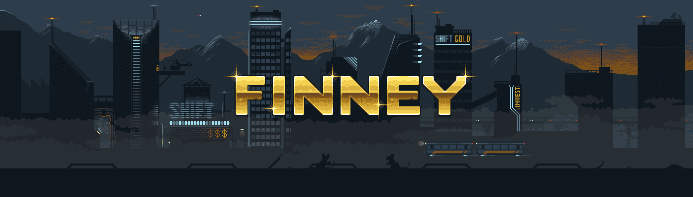

# CryptoFinney

10,000 个生成独特的 CryptoFinneys 登陆以太坊。第一个使用 GenDrops 平台合约启动的项目，CryptoFinney 具有多级升级机制、索赔和许多未来的会员福利，包括 DAO 投票。在他的家乡星球上，芬尼只是另一个由黄金制成的机器人。但当他开始前往地球学习加密货币和区块链技术时，芬尼成为了其中的一员。滑动下方查看芬尼卷。1. 未来的漫画将采用传统的故事板格式。Finney 目前正在探索以太坊、EOS和WAX区块链。花了 10 年时间听播客，然后在 2017 年掉进了加密兔子洞。住在澳大利亚，自从他的第一个 NFT 铸币后就再也没有见过阳光。

