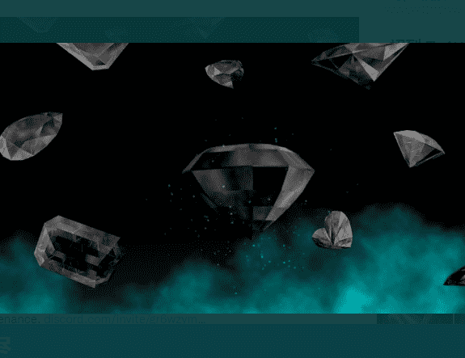

# Crypto Gem Alliance

的未来
宝石
采矿 → 化学 → 铸币
在以太坊的支持下，这些宝石的艺术表现形式是稀缺的。 使用权益证明模型，CGA 以公平和预定义的方式将铸币交给石头所有者。加密宝石是宝石的下一个进化步骤，保证稀有性、所有权和出处。加入使用权益证明模型的联盟，将采矿权交给 Crypto Gem 所有者。每个 Crypto Gem 都采用复杂的几何设计和公式设计，以包含标志性缺陷，就像天然宝石一样。 这三个签名中的每一个都有一个随机生成的值，从 A 到 C 对质量进行评分。

