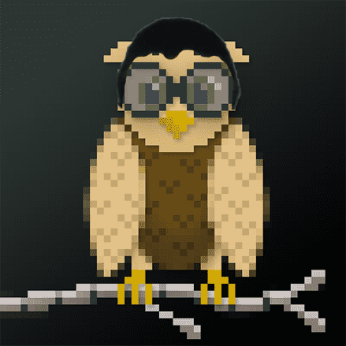

# CryptoHoots Alpha Parliament

CryptoHoots 是一群吵闹的蒸汽朋克猫头鹰，他们认为 20 世纪是一个错误。他们生活在虚拟世界的另一个时间线中，齿轮驱动的小工具和蒸汽动力机械统治着它们的栖息地。他们不需要电。他们的区块链技术使用*实际*链和块。必须研究这些迷人的生物！我们需要您的帮助来编目此时间线中的 2,500 个 Hoot。

识别声音
尽管它们是轻而易举的鸟，但每个人都有可证实的独特个性。野外存在四种主要品种，但如果你足够幸运，你会瞥见一种稀有的机械Hootoid。也有关于不死生物、没有羽毛的叫声的谣言，但没有人活着告诉我们。

在该领域
每只鸟都有多达 12 种独特的特征。虽然有些 Hoot 喜欢闲逛，像一只松鸦一样赤身裸体，但其他人则更喜欢，咳咳，老练。在野外发现了大量的蒸汽朋克服装。尝试收集最稀有组合的样本。

你需要什么
你需要 MetaMask 或支持 WalletConnect 的以太坊钱包和一些 ETH。下载适用于 Chrome 或 Brave 浏览器的 MetaMask 扩展程序，并从 Coinbase 或 Kraken 等交易所使用 ETH 为其提供资金。请继续关注Twitter和Discord上的官方公告。发布日期将很快公布！

