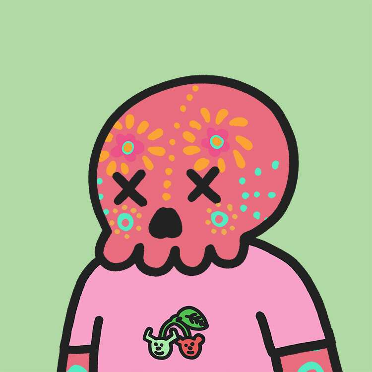

# CryptoMories

“Memento Mori”，记住你死了”。这是一句古老的拉丁谚语，提醒人们生命短暂，必须活得充实。它传统上以头骨为象征，现在已经进入元宇宙。

Mories 是第一个为其所有所有者提供真实生活、无限且免费的心理健康远程治疗的系列。他们是有史以来最成功的 NFT 项目之一，并以其社区的善良和创造力而闻名。

莫里斯已经成为一个品牌。该团队现在专注于让这个品牌在现实世界、视频游戏行业以及体育行业中大放异彩。

要了解更多信息，请在 Twitter 上关注我们，了解什么是海啸。

