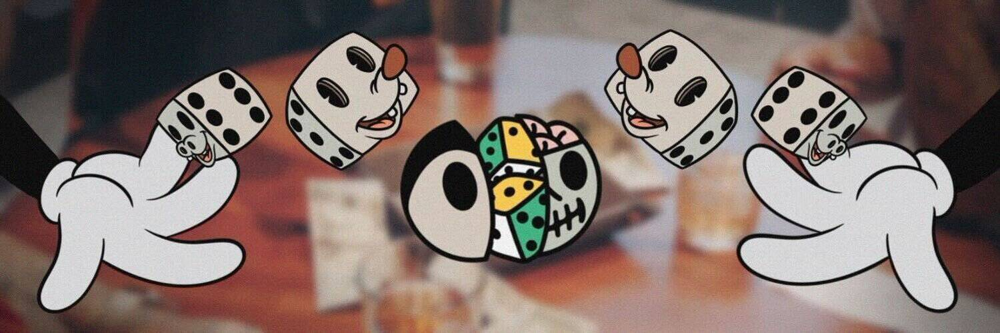

# Cryptoon Goonz Originals

Cryptoon Goonz 是由著名纹身艺术家 Sean Morgan 设计的 6,969 个怀旧“橡胶软管风格”角色的集合。这些手绘人物的灵感来自他对街头服饰、嘻哈和几代卡通的热爱。

Gooniverse 一直在增长。作为 Goon Gang 的一员，您将可以独家访问我们的服装、新体验、现场活动，以及随着时间的推移将揭晓的更多内容。门户已打开。你会去旅行吗？

Cryptoon Goonz 系列由 6,969 个可生成橡胶软管风格的角色组成，由数百个独特的特征组成，这些特征不仅改变了单个 Goon 的外观，而且完全改变了 Goon 将采取的形式。无论是狼、猫还是猿/棉花糖混合体，Cryptoon Goon 的每一个品种都以流行文化、嘻哈和街头服饰为参考。我们非常关注高质量的艺术和社区。加入我们，参与我们的旅程，打造特别的东西。

