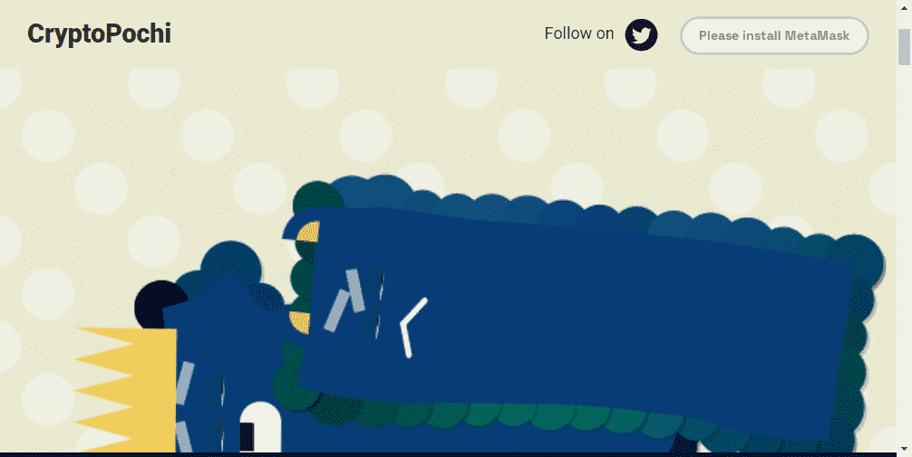

# CryptoPochi

什么是波奇斯？
CryptoPochis 是一种神秘的生物，可以捕捉你日常生活中的不同情绪。他们的脸不言自明。他们只是躺在地上玩一整天。我们将它们捕获并包装为 NFT 供您使用。
波奇斯是从哪里来的？
我们很高兴你问！CryptoPochis 源于 艺术家 Che-Yu Wu 在 日常创意编码系列中的生成艺术项目Sleepy Pochi。一些灵感还来自传奇的 LocoRoco 电子游戏。
海火腿，什么？
Sea Hams 是 Art Blocks 社区的重要组成部分，这要归功于它们独特的外观和引人入胜的背景故事，这可以追溯到生成艺术家吴哲宇。
哦，我们有没有提到 拥有海火腿 会让你踏入波奇斯的早期薄荷门？钱包快照将在早期铸币开始前 2 小时拍摄。每个火腿都有一个Pochi。因此，无需将它们分散到不同的钱包中。

