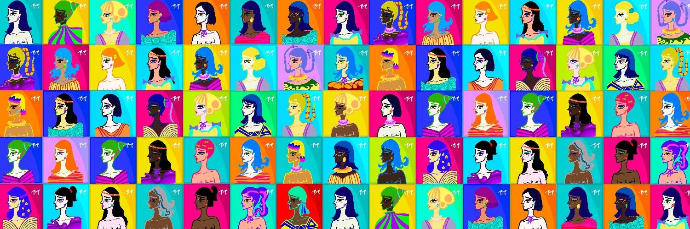

# CRYPTOPOP_OFFICIAL

Crypto PoP 是由 15 岁的女艺术家创作的 5.5K NFT 女性角色的集合。所有利润的 20% 将用于支持乌克兰母亲和儿童——战争的受害者。

1. 传播包容性、多样性和善意。
  我们收集的 NFT 包含超过5,555 个独特而强大的女性角色。它们中没有一个是相同的，但它们的差异都是美丽而强大的。这个世界如此鼓舞人心，因为我们每个人都是不同的——拥抱这些差异，因为它们很美，让你成为你自己！

2. 支持乌克兰妇女和儿童
  Crypto PoP 希望让世界变得更美好，未来更光明。数以百万计的乌克兰家庭失去了家园和梦想——他们的希望和未来被摧毁。我们来自波兰，乌克兰在我们心中；目前，有超过200万乌克兰母婴因乌俄战争逃往波兰。Crypto PoP 希望在悲伤的时刻带来绝望和欢乐的希望。我们所有销售额的 20% 将用于支持乌克兰的母亲和儿童。保持强大的乌克兰，我们心中有你❤️🇺🇦 

3. 传播正能量、快乐和幸福。
  我们的世界充满了失望、悲伤和悲伤——日常现实的灰色和黑色令人窒息并剥夺了积极的情绪。很容易迷失在抑郁的深渊中。我们明亮而快乐的 NFT 旨在让一个人振作起来，给脸上带来微笑。

  我们希望霓虹灯的颜色会照亮您一整天，并提醒您保持积极态度，做一个好人。

  
