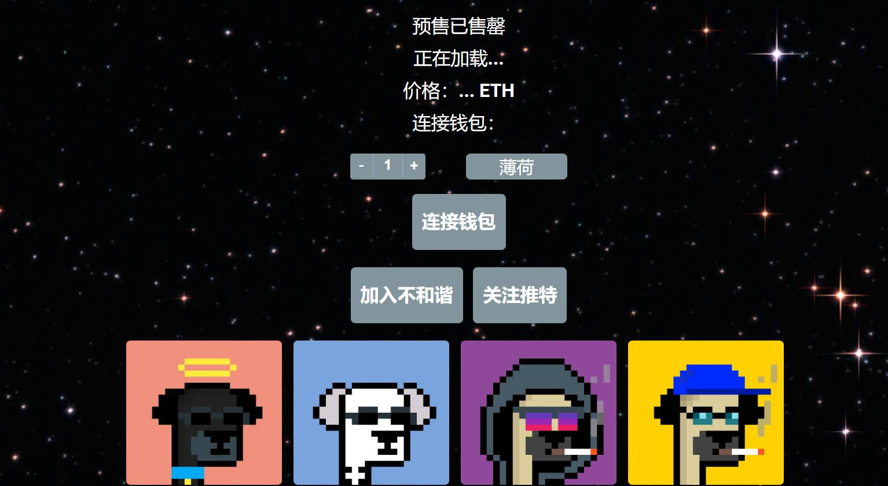

# CryptoPugsNFT

CryptoPugs 是 3,500 个独特的、随机生成的哈巴狗的集合，它们作为 ERC-721 NFT 在以太坊区块链上漫游。每个 CryptoPug 都是独一无二的，并且是通过无限组合属性和特征（如背景、皮肤、嘴巴、头发、眼镜等）以编程方式生成的。有些哈巴狗比其他的更稀有。

我是新手。我如何铸造 NFT？
最简单的方法是下载 Metamask（一个保存你的加密货币和 NFT 的去中心化钱包），然后将 ETH 发送到你的新 Metamask 钱包。之后，一旦我们启动，点击我们 CryptoPugs 网站上的“MINT”按钮。

