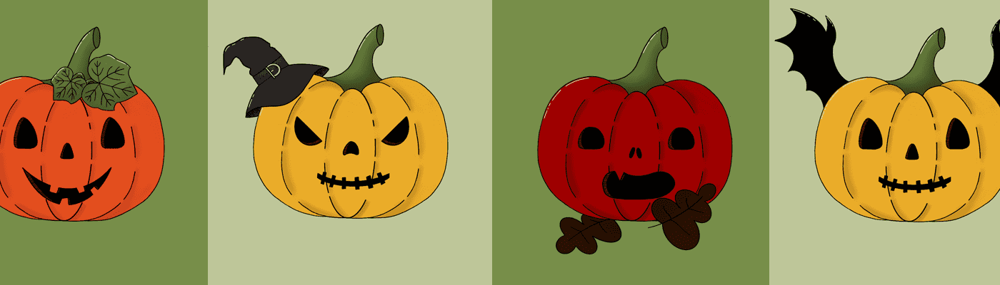

# Crypto Pumpkin Patch

欢迎来到加密南瓜补丁。我们是4,000 个独特的、随机生成的南瓜的有限集合，这些南瓜生长在我们自己的区块链小空间中。我们有些人很可爱，有些人很可怕，但我们所有人都很可爱。我们在 Polygon 网络上作为ERC-721代币存在，因为我们自己创造了足够的气体，我们不想拿走你们的任何气体！我们的漂亮外观和证书在IPFS上，所以你知道他们不会去任何地方！从现在到 2021 年万圣节，每天都会有 66 个人出现。在我们新鲜的时候快速选择我们中的一个！

