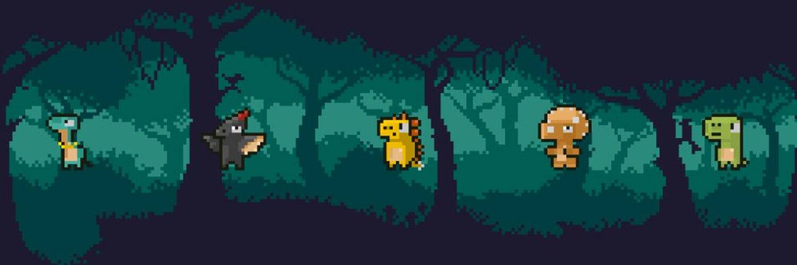

# Cryptorus V1

欢迎来到 Cryptorus Land

经过漫长的加密冬天，恐龙在像素中重生。科学家们创造了 Cryptorus Land，以便恐龙能够生存。冒险者来到这片土地，寻找恐龙蛋。几天后，一位冒险者发现了一个像素蛋。在 Cryptorus Land 开始你的冒险！

阶段1
大公开赛
冒险者来到 Cryptorus Land 进行新冒险的那一天。网站和社区将被激活。
阶段2
薄荷
这是 10,000 只恐龙以像素重生的日子。
第三阶段
火车
训练师持有恐龙的时间越长，他/她可以获得的代币奖励就越多。
第 4 阶段
品种
通过Tricky和其他恐龙之间的繁殖，冒险家将获得小恐龙。小恐龙可以被收养或培养以获得额外奖励。
第 5 阶段
攻城战
五种恐龙决定在 Cryptorus Land 内建立一个独立的王国。攻占彼此王国的围攻将爆发以获得更大的回报。

