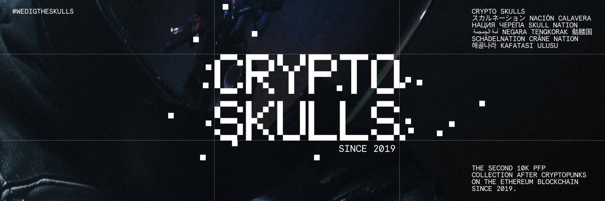

# Cryptoskulls & Ukraine

CryptoSkulls 是存储在Ethereum / Polygon区块链上的 10,000 个可收藏的 ERC-721 非同质代币 (NFT) 。

每个 CryptoSkull 字符都是具有唯一性索引属性的唯一像素艺术。此属性显示所有图像特征的完全稀有性。具有稀有特征的 CryptoSkulls 具有较少的唯一性指数。

每个 CryptoSkull 都是即将推出的 Gold of Skulls游戏中的可玩代币。该游戏将是第一个收集令牌的唯一性将影响玩家的唯一性的游戏。这将是革命性的。
为了支持游戏开发，我们将1000 个CryptoSkulls 标记为游戏代币——这些代币将在游戏中具有额外的功能！

