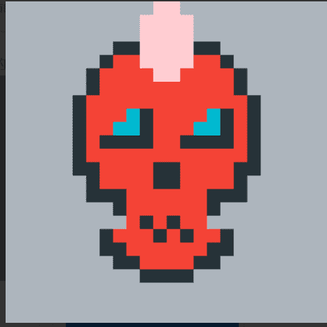

# CryptoSkulls

CryptoSkulls 是存储在Ethereum / Polygon区块链上的 10,000 个可收藏的 ERC-721 非同质代币 (NFT) 。
每个 CryptoSkull 字符都是具有唯一性索引属性的唯一像素艺术。此属性显示所有图像特征的完全稀有性。具有稀有特征的 CryptoSkulls 具有较少的唯一性指数。核实！
10 CryptoSkulls 是传说中的手绘图像。他们被称为骷髅王。他们的唯一性指数是1。极其稀有！

完整的商业权利
CryptoSkulls 所有者对其钱包中的艺术品拥有完整的商业权利。

商品销售、衍生品和商业用途
商品、衍生品或其他商业用途的收入没有货币限制。

版权转让
我们认为区块链交易满足版权转让的法律要求。因此，每个单独图像的版权所有权由分配该图像的不可替代令牌 (NFT) 的 Ethereum/Polygon 地址决定。将 NFT 转让或出售给新所有者后，前所有者放弃所有版权主张。

