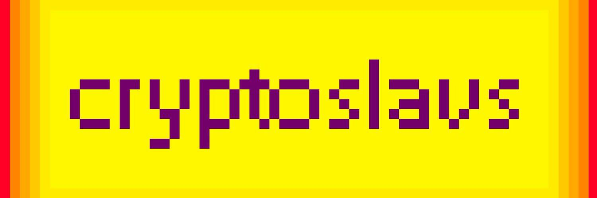

# Cryptoslavz

对于世界上大部分地区来说，所有俄罗斯人都是拥有伏特加和其他刻板印象的斯拉夫人。但我们国家有不同的民族和文化，和平共处。当然，其中只有一些是斯拉夫语，但每个 Cryptoslav 都有可识别的属性。

▶ 什么是 CryptoSlav？
CryptoSlav 是一个 NFT（不可替代令牌）集合。存储在区块链上的数字艺术品集合。
▶ 有多少 CryptoSlav 代币？
总共有 282 个 CryptoSlav NFT。目前，82 位所有者的钱包中至少有一个 CryptoSlav NTF。
▶ 最近卖出了多少 CryptoSlav？
过去 30 天内售出 0 个 CryptoSlav NFT。

