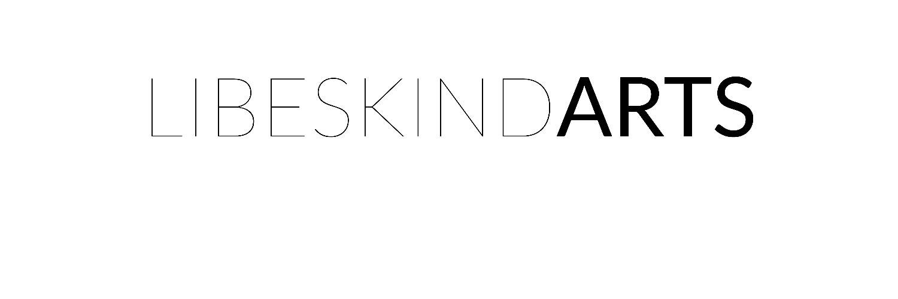

# CRYPTOSONOGLYPHS

数字艺术 NFT 代表了一种令人难以置信的令人兴奋的新媒体，能够进行激进和复杂的艺术表达形式。艺术家们现在才刚刚开始探索这些新技术的可能性。

许多 NFT 只不过是任何人都可以访问的内容的数字签名，在某些情况下可以有合法的应用程序，但肯定永远不会完全替代原始的物理艺术品。NFT 挑战我们不仅要创建令人惊叹的数字图像、动画或音频文件，而且要在技术上尽可能接近不可复制的原创内容，因为它在其结构中拥有任何人都无法访问的独特和特殊价值除了代币持有者。

