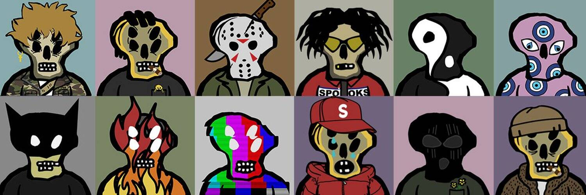

# CryptoSpooks Genesis

我们找到了一种更好的方式与我们的恶魔共存，不再被他们困扰。

由 Nabil Zaidi 设计的 3,001 个生成 PFP CryptoSpooks。

▶ 什么是 CryptoSpooks Genesis？
CryptoSpooks Genesis 是一个 NFT（不可替代令牌）集合。存储在区块链上的数字艺术品集合。
▶ 存在多少 CryptoSpooks Genesis 代币？
总共有 3,001 个 CryptoSpooks Genesis NFT。目前 850 位所有者的钱包中至少有一个 CryptoSpooks Genesis NTF。
▶ 最近卖出了多少 CryptoSpooks Genesis？
过去 30 天内售出 0 个 CryptoSpooks Genesis NFT。
▶ 什么是流行的 CryptoSpooks Genesis 替代品？
许多拥有 CryptoSpooks Genesis NFT 的用户还拥有 EL NUMEROS、 DegenOkayBears、 WaterBe4nZuki和 Old Legacy。

