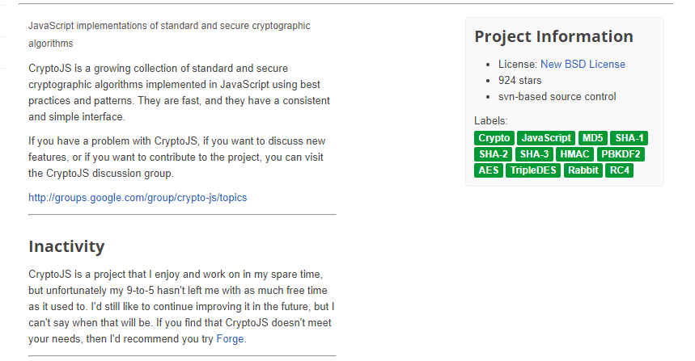

# CrypToss

一款以太坊驱动的投币游戏。与其他人下注赢得大奖！*CryptoJS*是使用最佳实践和模式在 JavaScript 中实现的标准和安全加密算法的不断增长的集合。加密标准的 JavaScript 库。通过在 GitHub 上创建一个帐户，为 brix/ *crypto-js开发做出贡献。*2021 年 7 月 22 日—加密标准的 JavaScript 库。最新版本：4.1.1，上次发布时间：一年前。通过运行...开始在您的项目中使用*crypto-js*2022年6月15日 — *CryptoJS* API. 这里以AES加密，加密的对象分为两种情况：纯文本和对象。 纯文本加密 var*CryptoJS*是使用最佳实践和模式在 JavaScript 中实现的标准和安全加密算法的不断增长的集合。

