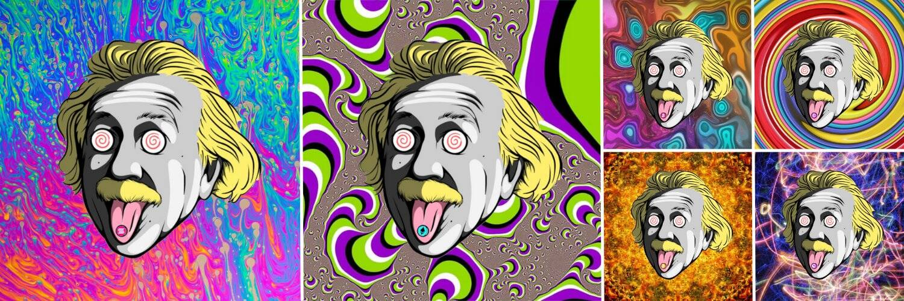

# CryptoSteinz

第一个允许收藏家向世界展示他们所支持的加密代币的 PFP 收藏就在这里！  

Steinz 博士是一位非常以自我为中心的科学家，他创造了 696 个疯狂的生物来帮助他在加密世界中进行实验：CryptoSteinz。

不幸的是，对于医生来说，他们都因为 FOMO 和他们的加密热而失去了理智。每个 CryptoSteinz 都是独一无二的，药丸的颜色和符号将决定所有者将获得的奖励。

Steinz 博士设法找到了一种方法来创建新的 CryptoSteinz 并多次复制它们。每个 CryptoSteinz 克隆都需要付出巨大的努力来创建和复制，因此只能生成 12 个不同的 CryptoSteinz 克隆。

CrytpoSteinz 克隆不出售，只能通过秘密行动才能拥有：您会知道如何收集它们吗？

CryptoSteinz 克隆保证了多项好处（例如被动收入、商品折扣……）。在我们的 Discord 服务器上详细阅读它们。

