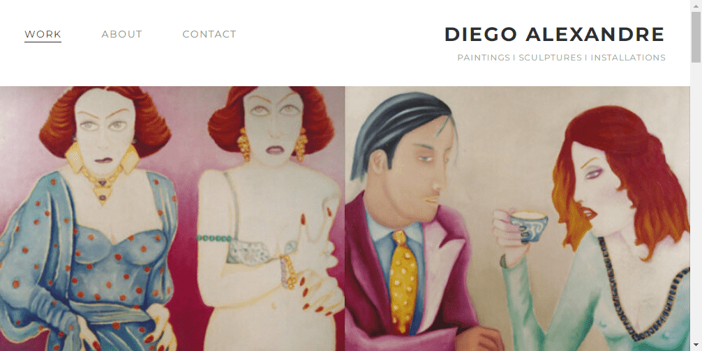

# Cryptoties by Diego Alexandre

迭戈·亚历山大
他出生在布宜诺斯艾利斯，他生活和工作的城市。
1988 - 1999与Ricardo Garabito一起学习绘画。
1986 - 1988与Héctor Giuffre一起学习绘画。

个人展览
2021 小图纸。梅嫩德斯图书馆画廊。布宜诺斯艾利斯。阿根廷。
2015  无法控制的欲望。爱马仕阿根廷。（由法国巴黎爱马仕挑选和邀请）。 
2014 年  “受到怀疑”。布宜诺斯艾利斯现代艺术博物馆。曼巴。
2013  反映- 博尔赫斯文化中心。    
2010  年开关。雷科莱塔文化中心。布宜诺斯艾利斯
2010 年  科格兰站的壁画。激情 x 布宜诺斯艾利斯。市政府。布宜诺斯艾利斯

