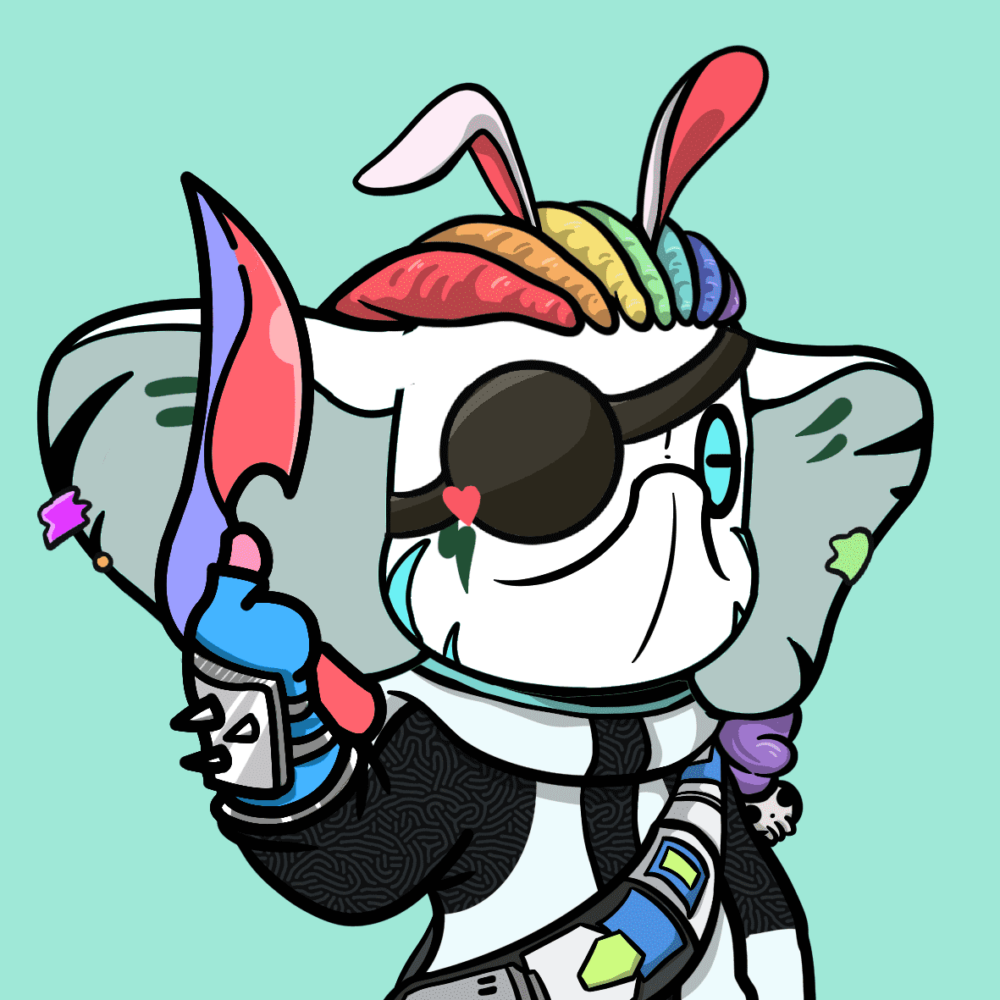

# CryptoToysClubNFT

1.Crypto Toys Club是做什么的？
帮助音乐人、漫画家、电影制作人推出自己的 NFT 并以权利和粉丝 DAO 的形式从中获利。

2. Crypto Toys Club DAO 会做什么？
为音乐家、漫画家和电影制作人拍摄音乐视频、录制音乐和制作作品提供财政支持。

3. Crypto Toys Club NFT 和 Plath DAO 是什么关系？
就像 BAYC 和 Yugalabs

4.持有加密玩具俱乐部NFT有什么好处或优势？
CTC DAO 治理；
所有主要的 IP NFT 空投；
蓝筹 NFT 白名单；
CTC图像商业权利。

5、我有IP和明星资源，我是创作者，怎么和CTC合作？
通过我们的官方 Twitter
联系我们 通过 Discord 社区频道 Discord 联系我们：
6.下一步是什么？
计划了很多，深入了解可编程智能合约和去中心化商业文化的未来时代，以跟踪所有这些，加入我们的 Discord；
Ambrose Chow，金钟奖制片人，代表作品《嘎涛》
沉北客，漫画家，代表作品《国魂归雁》，巴黎之家轩辕
签约设计师，高级经纪人

