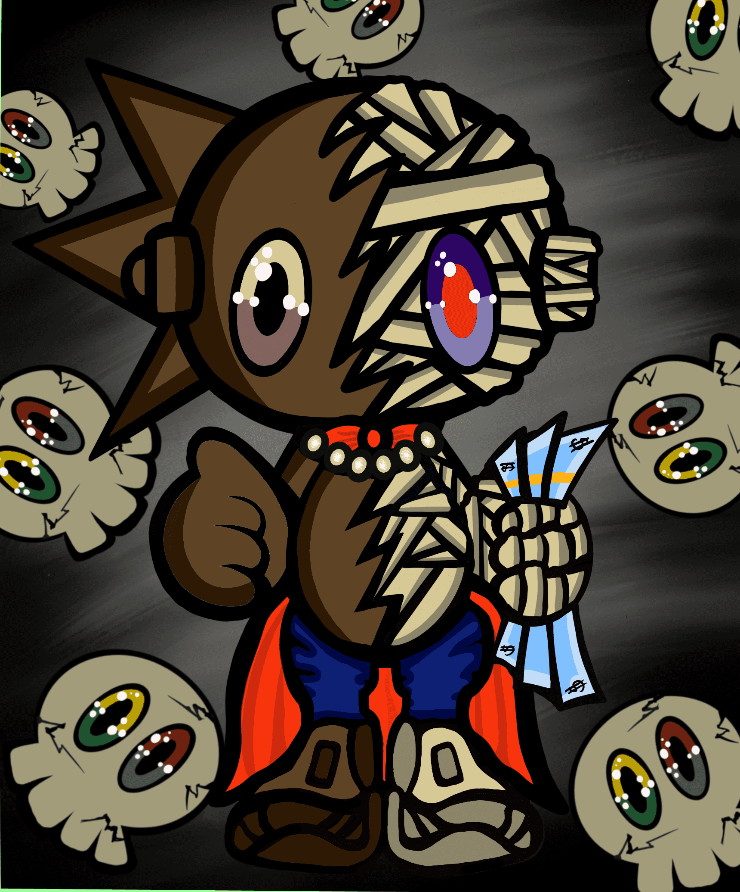

# CryptoTwins by VeraTwins

过去 7 天内没有出售 VeraTwins 的 CryptoTwins。

VeraTwins 的第一个已经离线的已知艺术收藏。其中 333 人将在区块链上聚会。

▶ VeraTwins 的 CryptoTwins 是什么？
VeraTwins 的 CryptoTwins 是一个 NFT（不可替代令牌）集合。存储在区块链上的数字艺术品集合。
▶ VeraTwins 代币存在多少 CryptoTwins？
VeraTwins NFT 总共有 354 个 CryptoTwins。目前，159 位所有者的钱包中至少有一个 VeraTwins NTF 的 CryptoTwins。
▶ VeraTwins 销售的最昂贵的 CryptoTwins 是什么？
VeraTwins NFT 出售的最昂贵的 CryptoTwins 是 CryptoTwins #182。它于 2022 年 6 月 20 日（2 个月前）以 20.9 美元的价格售出。
▶ VeraTwins 最近售出了多少 CryptoTwins？
在过去 30 天内售出了 1 个 VeraTwins NFT 的 CryptoTwins。
▶ VeraTwins 的流行 CryptoTwins 替代品有哪些？
许多拥有 VeraTwins NFT 的 CryptoTwins 的用户还拥有 Metathugs3d V2、 Fantastic Alien ETH、 Loser Ape Club Official和 APE BANKING CLUB-NFT ABC METABANK。

