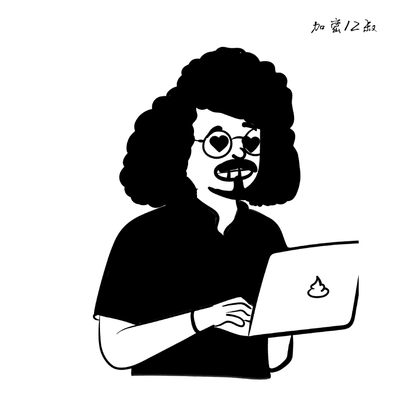

# CryptoUncle12 NFT(ETH)

加密12叔nft全链一共12000张，12用于纪念在web2的12年，同时也是告别web2积极拥抱web3的开始！ 无discord、无电报，设置了极低的价格是为了防止机器人抢铸！nft通过@LayerZero_Labs构建。是继@gh0stlygh0sts之后第二个全链NFT。
如何铸造(mint)？
1⃣️确定要铸造的链，点击上方合约地址，打开对应的区块链浏览器

2⃣️切换metamask(小狐狸)钱包到对应的网络，添加网络可以用Chainlist工具

3⃣️点击Contract，切换到该Tab，如下图所示

