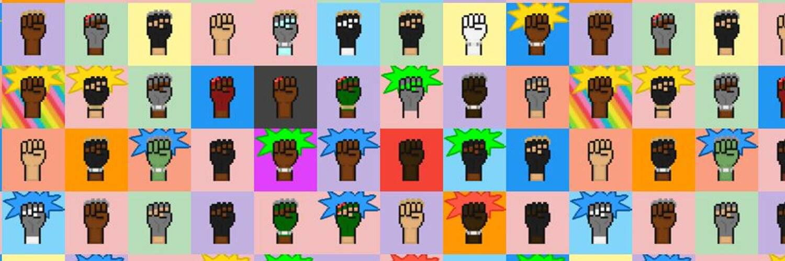

# CryptoUnite

在复杂的白名单计划、未来主义设计、夸张的收藏、荷兰拍卖和高价造币厂的海洋中，我们想回归基本面。

CryptoUnite 的目的是将纯粹性和简单性带回 NFT 社区。

我们创建了一个简单的像素艺术集合，仅包含 1000 件物品，因为我们相信少即是多。

我们的每个拳头设计都由随机生成的特征组成，为我们所有的持有者提供完全独特的 NFT。

团结一致，我们致力于将纯粹和简单带回#NFT社区。

