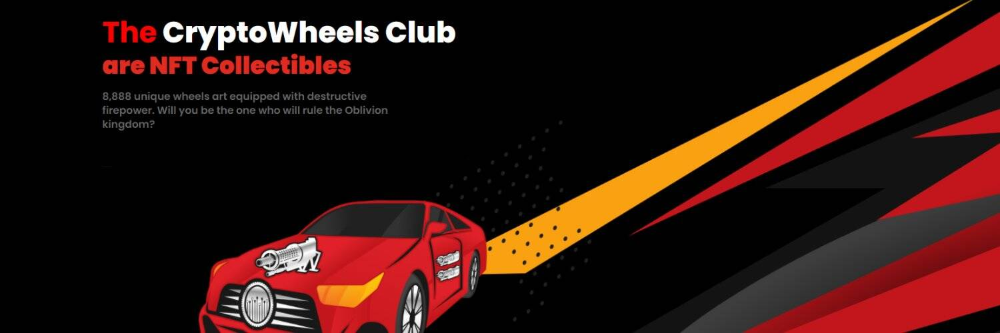

# Crypto Wheels Club (Official)

8,888 个独特的轮子艺术 NFT，配备破坏性火力。你会成为统治遗忘王国的人吗？CryptoWheels是 8,888 件独特的手工艺术品的集合，其中包括具有大规模破坏能力的火力车辆。该系列的重点是赋予持有者统治遗忘王国的最终权利。使用您的车轮的破坏力来夺取王位并获得现实世界的好处（待定）。 它的 2187 年和世界正在分崩离析。几十年来，一直存在着统治位于永恒区块链上的遗忘王国的冲突。骑士骑士（王国的现任统治者派系）突然消失后，7个最强大的派系争先恐后地争夺王国。这些派系包括致命的死亡阴影、恶魔、终结者、死亡皇后、黑魔和破碎者，它们拥有强大的火炮和蛮力，具有大规模破坏的能力。派系的所有成员在 Cryptoverse 中都被称为“轮子”。

战争开始了，让我们看看谁是我们遗忘王国的新主人，将统治永恒的区块链。

但随着战争的愈演愈烈，有一股神秘的力量从黑暗中将他们吞没！

你准备好见证 Cryptoverse 最史诗般的战斗了吗？你会成为遗忘的下一个统治者吗？

