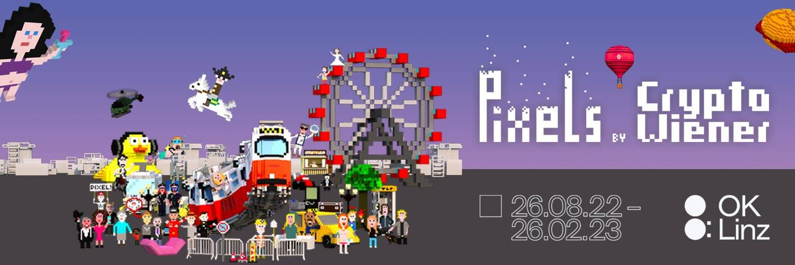

# CryptoWiener

CryptoWiener 在 Linzer OK 中征服了元界。通过我们真实的像素作品，我们将数字世界转化为模拟展览空间，并创造出多维体验。在展览中，参观者成为数字世界的一部分，学习如何在元宇宙中移动和交流，并最终将 CryptoWiener Multiverse 的一部分带回家。

数字世界和模拟世界之间的永久变化。
您自己的手机将成为门户，引导您穿越 CryptoWiener 色彩缤纷的虚拟像素世界：从咖啡馆，莫扎特在钢琴旁，您可以到达香肠摊或足球场，并在“见面和问候”。

