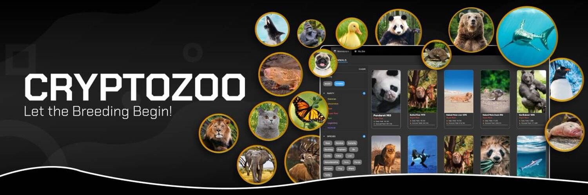

# CryptoZoo Base Animal

CryptoZoo 是一个自治的生态系统，用户可以在其中购买、出售和交易外来动物混合 NFT。杂种按稀有程度分类；您的动物越稀有，它们的产量就越高！我们的目标是通过提供真实生活价值的病毒式、有趣且令人上瘾的游戏来减轻进入 NFT 的障碍。让繁殖从 CryptoZoo.Co 开始 :)

▶ 什么是 CryptoZoo.co？
CryptoZoo.co 是一个 NFT（不可替代令牌）集合。存储在区块链上的数字艺术品集合。
▶ 有多少 CryptoZoo.co 代币？
总共有 4,160 个 CryptoZoo.co NFT。目前，1,314 位所有者的钱包中至少有一个 CryptoZoo.co NTF。
▶ 最昂贵的 CryptoZoo.co 销售是什么？
CryptoZoo.co 出售的最昂贵的 NFT 是 2647。它于 2022-08-01（24 天前）以 129.4 美元的价格售出。
▶ 最近卖出了多少 CryptoZoo.co？
过去 30 天内售出了 15 个 CryptoZoo.co NFT。
▶ CryptoZoo.co 的费用是多少？
在过去 30 天里，最便宜的 CryptoZoo.co NFT 销售额低于 45 美元，最高销售额超过 124 美元。CryptoZoo.co NFT 的中位价格在过去 30 天内为 70 美元。

