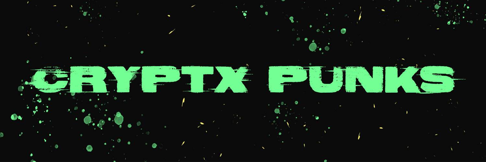

# Cryptx Punks

crytpx punks 的灵感来自于区块链上的 xcopy 和 crypto punks。不隶属于 xcopy、larva labs 或加密朋克。这个项目是cc0，你可以用它做任何你想做的事情。

▶ 什么是 Cryptx 朋克？
Cryptx Punks 是一个 NFT（不可替代令牌）集合。存储在区块链上的数字艺术品集合。
▶ 存在多少个 Cryptx Punks 代币？
总共有 2,222 个 Cryptx Punks NFT。目前，258 位所有者的钱包中至少有一个 Cryptx Punks NTF。
▶ 最昂贵的 Cryptx Punks 销售是什么？
出售的最昂贵的 Cryptx Punks NFT 是 Cryptx Punks #1045。它于 2022-06-19（2 个月前）以 0.4 美元的价格出售。
▶ 最近卖出了多少 Cryptx Punk？
过去 30 天内售出了 1 个 Cryptx Punks NFT。

