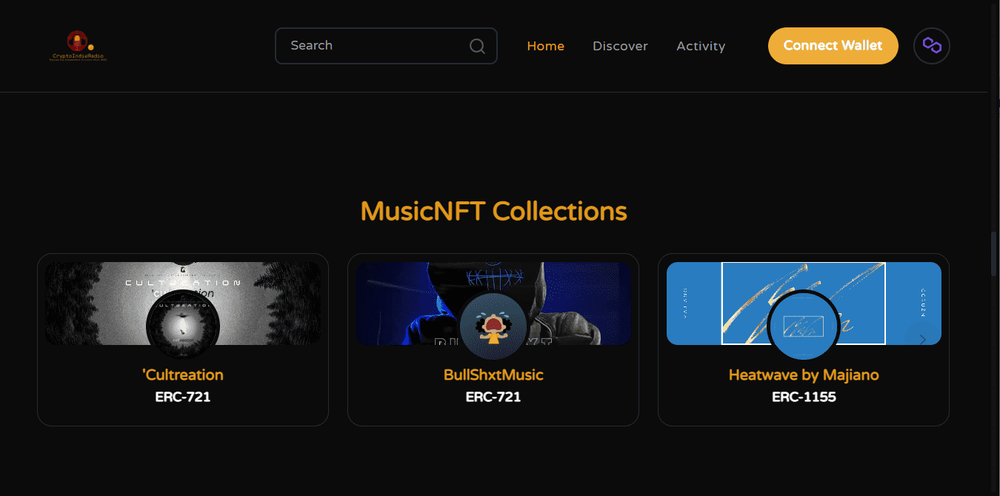

# Cultreation: Culture + Creation

AshtonLavish Cultreation 的 Cultreation Music NFT EP 是 AshtonLavish 第一个完整的 EP 项目。这是嘻哈的氛围。该项目是关于他在斗争、人际关系、家庭和社会意识的斗争中的观点。'文化：文化+创造文化是建立在我们所看到的、我们的成长方式和我们的生活经历的基础上的。它塑造了我们的创造力。建立我们自己的基础设施是 .. 我们的创造力推动了其他基础设施的成功，并允许它们获得金钱收益，而我们获得的收益更少或根本没有。

