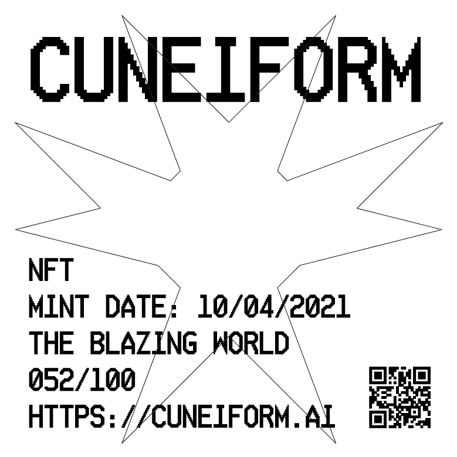

# CuneiformNFTS

楔形文字呈现：Carlson Young Genesis 系列Cuneiform 是一个用于流式传输和创建者 NFT 的 Web 3.0 内容分发平台。通过授权创作者在保留控制权的同时展示他们的内容，我们还在创新传统的票房票务系统，以促进粉丝参与他们喜爱的内容。更接近内容。更接近社区。更接近创作者。

楔形文字使观众能够支持他们最喜欢的创作者并从他们的成功中获得回报。

Cuneiform 通过利用 NFT 来促进观众参与并为门票作为收藏品提供更多价值，从而彻底改变了传统的票房票务系统。作为一个平台，楔形文字旨在让创作者能够更好地控制其内容的价值和分发。我们重视所有创作者的自主权。

完整的宣言即将推出！

