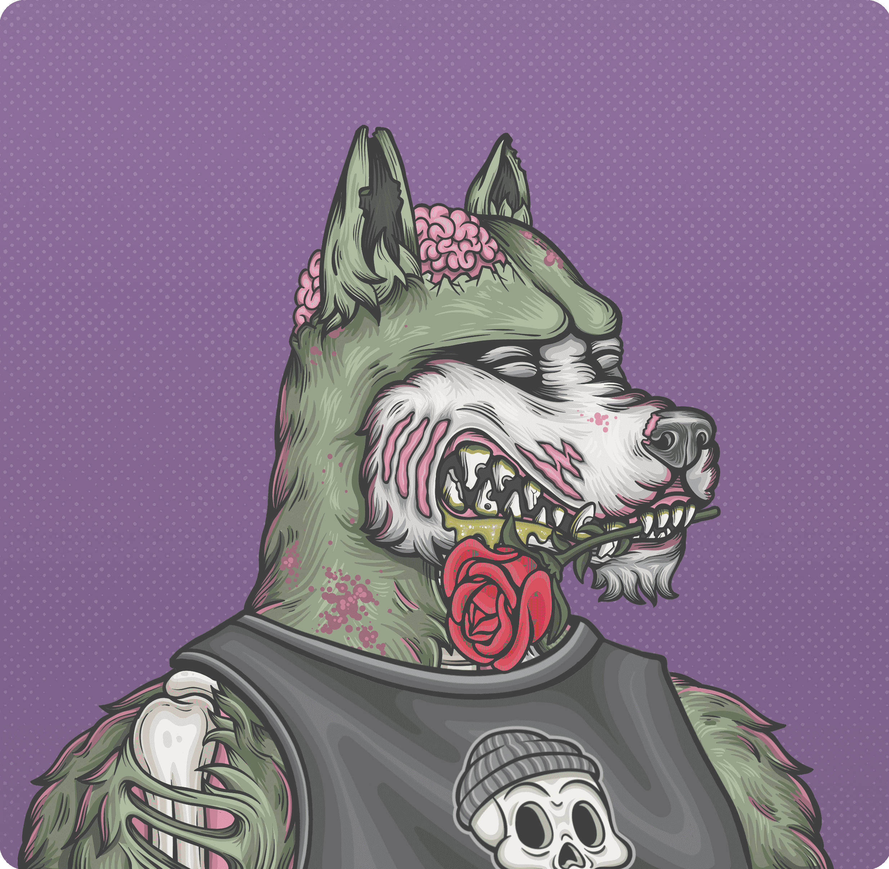

# Cunning Wolf Society CWS

欢迎来到
狡狼社
该协会是 5005 个 NFT ERC-721 Wolf 身份的家园，他们生活在 Metaverse 中，他们的意识托管在以太坊区块链上。每个身份都是独一无二的，并且由超过 130 种可能的特征通过算法生成。有些狼更稀有，但都是独一无二的。

我们是有目标的人，渴望学习，渴望征服现状。我们的主要品质之一是我们愿意承受弥漫在 NFT 领域的愚蠢乐观主义并接受理性的乐观主义；也就是说，我们并非所有人都能成功，只有那些选择从蜂巢思维中拔出的崇高道路的人才能成功。我们是 Geri 和 Freki 的后裔；愿意为了追求最崇高的目标——知识——而牺牲任何东西——没有什么能挡住我们的路。

我们是狡猾的狼。

