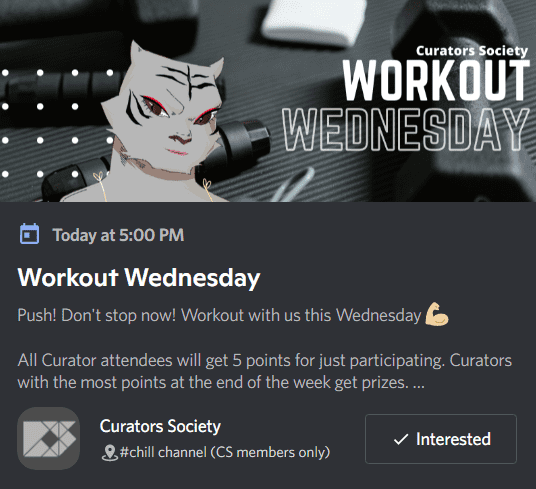

# Curators Society (Passes)

策展人协会是首屈一指的元宇宙俱乐部。它是娱乐、非凡活动和友谊的场所；这是一个体验 web3 所提供的最好的地方，而且是在最好的公司里。与其他正在塑造去中心化世界的多样化结构和能量的 web3 公民建立联系。

Founders Pass 的持有者有权使用 Curators Society 的所有最有价值的实用程序，但与我们的 Genesis Curator NFT 持有者的主要会员资格相比，他们是次要会员。Founders Pass 没有对 Genesis 保险库的管理权，并且将具有有限的“俱乐部中的俱乐部”利益。

▶ 什么是策展人协会（通行证）？

Curators Society (Passes) 是一个 NFT (Non-fungible token) 集合。存储在区块链上的数字艺术品集合。

