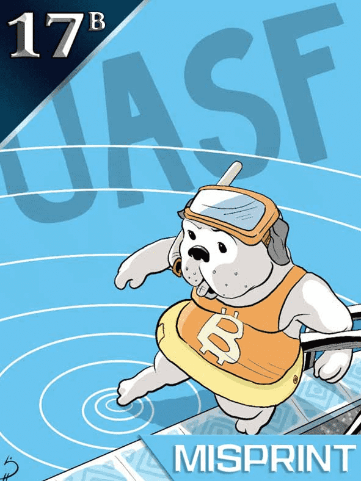

# Wrapped Curio Cards

Wrapped Curio Cards：世界上第一个原型 NFT 的第一个 ERC-1155 包装，在原始 ERC-721 规范中提到。Curio Cards 是部署在区块链上的 30 张独特的艺术卡片——这是同类中的第一个，早于 CryptoPunks 和 MoonCatRescue。这是第一个用于 Curio Cards 的原始非官方全功能包装器。此系列中的每张卡片均由 2017 年的官方原始 ERC-20 古玩卡以 1:1 支持。包装古玩卡和原始古玩卡可以在任何时间和任何数量无缝地来回转换，或者直接使用包装合同，或使用我们在网站上的 UI 。这些古玩卡包含与我们姐妹验证的收藏完全相同的基础代币（它们是相同的东西）。我们的收藏还包括 17B - 卡 17 ('UASF') 的早期复制部署。

