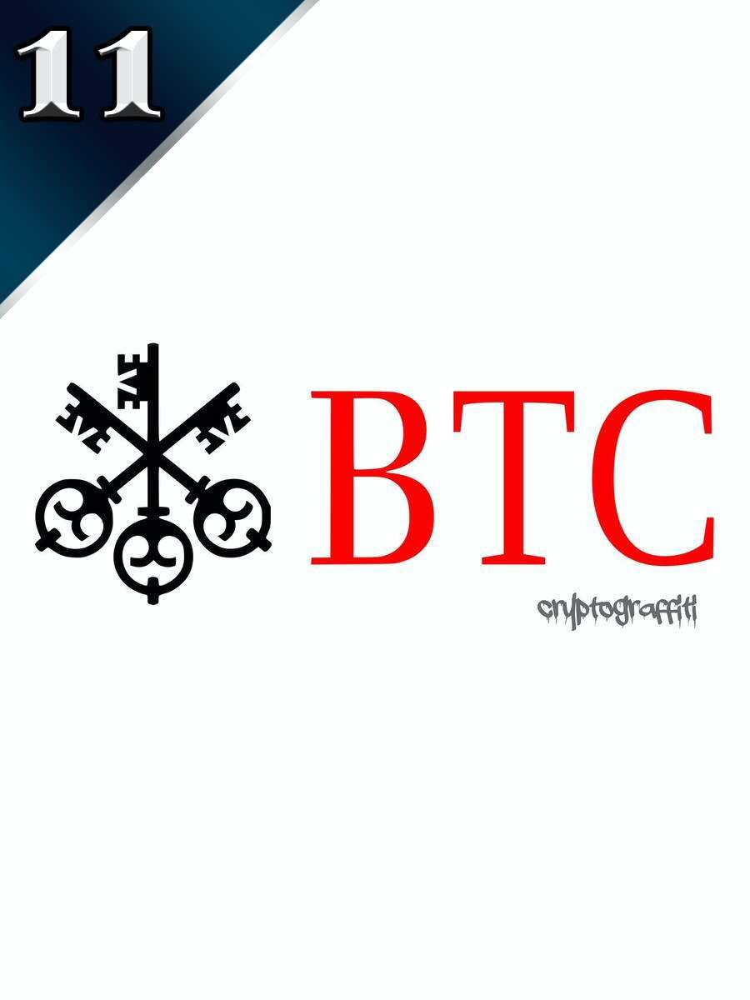

# Curio.Cards

Curio Cards是一个在线艺术展，是以太坊上的 First Art NFT，于 2017 年 5 月 9 日推出。Curio Cards 拥有来自七位不同艺术家的 30 个独特系列的卡片，在原始 ERC-721 非同质代币标准和预约会 CryptoPunks。加入Curio Discord并查看Curio Docs以了解更多信息。考虑到它们的年龄，Curio Cards 可以在 OpenSea 等平台上工作。如果您在 2021 年 3 月之前直接从原始合同中购买了卡片，则可以在此处打包。否则，您无需执行任何操作。OpenSea 上的所有卡片都已打包。1% 的艺术家版税完全归原始 Curio Cards 艺术家所有。

