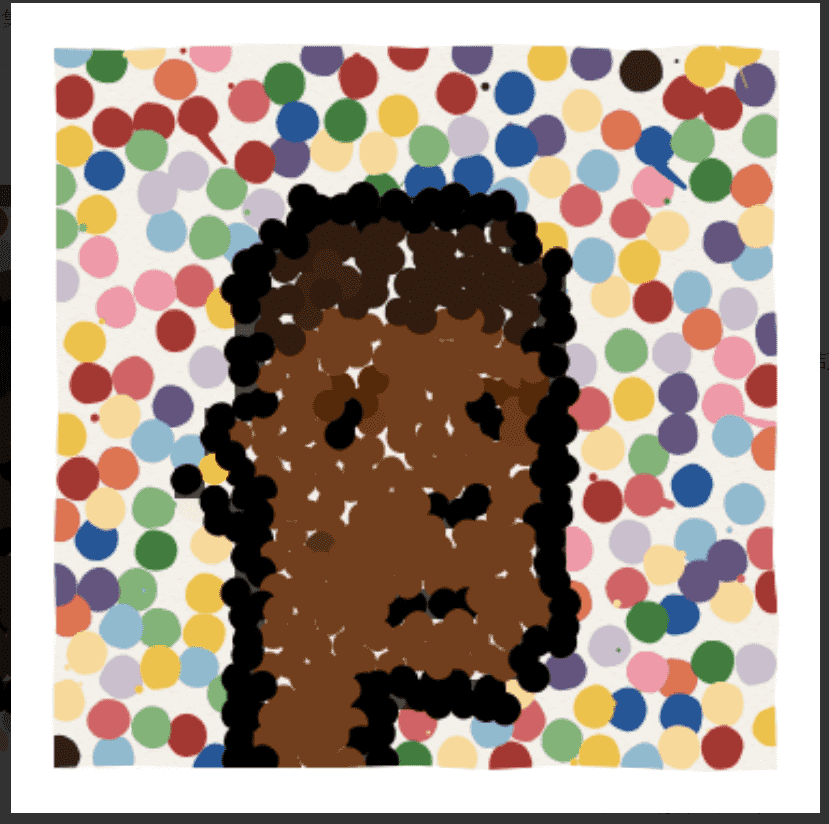

# CurrencyPunks

Punksverse 的骄傲成员
ArtCodeNFT 开发和维护 CryptoPunks 的衍生 NFT 集合。我们相信 CryptoPunks 是一个革命性的项目，是其自身宇宙的中心。我们通过创建和开发独特的艺术衍生系列来为 Punksverse 做出贡献。

货币朋克
CurrencyPunks 体现了艺术已成为货币这一事实。经过多年的成熟，NFT 终于形成了艺术、加密和市场的融合体。该系列的灵感来自Damien Hirst 的 The Currency，并向其致敬 。

马列维奇朋克
当艺术遇到金钱时，马列维奇朋克就会发生。艺术与金钱的界限在哪里？多亏了 NFT，它变得越来越模糊，允许革命性的合并。构图、颜色、角度、形状、抽象成为围绕数字的填充物，成为永恒不变的一部分。这个 NFT 系列是对Kazimir Malevich的致敬， 并试图让他的名字和遗产更容易被识别。

